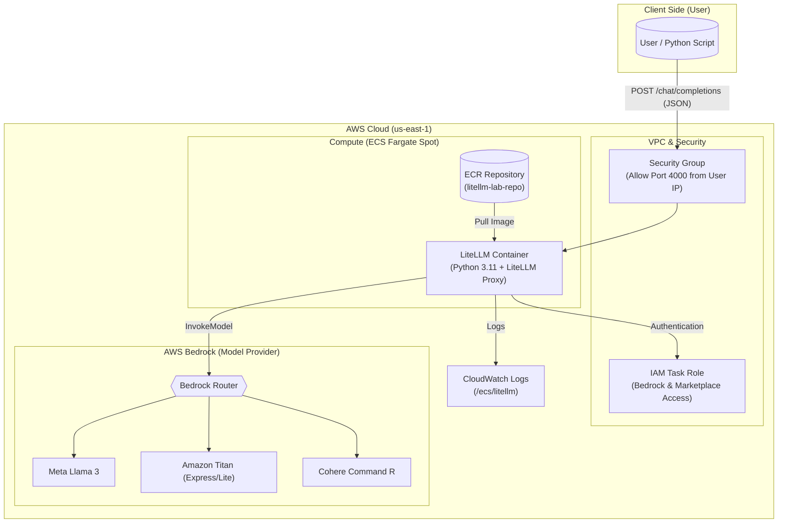

# Serverless Multi-Model AI Proxy on AWS

This project demonstrates a production-grade deployment of **LiteLLM** as a secure AI Gateway on AWS. It allows applications to access multiple Bedrock models (Cohere, Llama 3, Titan) through a single OpenAI-compatible API endpoint.

## 🏗  Architecture
Here's a highlevel overview of the architecture for this tool.



* **Infrastructure as Code:** Terraform
* **Container Orchestration:** AWS ECS (Fargate Spot)
* **API Gateway:** LiteLLM (Python)
* **Security:** IAM Roles (Zero Static Keys) & Dynamic IP Whitelisting

Once the solution is deployed, the traffic flow operates as follows:

1. **Client Side & Security (Ingress)**: Traffic originates from the local client machine. Incoming requests are evaluated against a Security Group first. The Terraform blueprint dynamically identifies the public IP address of the client (you) and configures the firewall to allow traffic only from that specific IP. All other traffic is dropped immediately. Crucially, the container relies on an IAM Task Role for authentication, meaning no static AWS keys are hardcoded in the application.

2. **Compute Layer**: While adaptable for production, the initial design prioritizes cost efficiency by utilizing AWS Fargate Spot. The LiteLLM container runs as a serverless task, listening on port 4000 for incoming API calls. It automatically handles the translation between OpenAI-compatible requests and AWS Bedrock requirements.

3. **AI Model Layer (Backend)**: LiteLLM acts as a smart router. Based on the model parameter in the user's request (e.g., bedrock-cohere), it forwards the prompt to the specific Amazon Bedrock model (Titan, Llama, or Cohere). The response is then streamed back through the proxy to the user in real-time.

## 🚀 Features
* **Multi-Model Routing:** Seamlessly routes traffic between Anthropic, Cohere, Meta, and Amazon models.
* **Cost Optimized:** Uses Fargate Spot instances to reduce compute costs by ~70%.
* **Secure by Default:** * No hardcoded AWS keys (uses IAM Task Roles).
    * Network locked down to the administrator's specific IP via Terraform.
* **Resilient:** Automated "Self-Healing" deployment scripts (Python & Bash).

## 🛠  Prerequisites
* AWS CLI (Configured with Administrator Access)
* Terraform v1.0+
* Docker
* Python 3 (Optional, for the Python deployment script)

## 💻 Usage

You can deploy the entire environment using either the Python script (recommended for better error handling) or the Bash script.

### Option A: Python Deployment (Recommended)
The \`demo.py\` script provides structured logging, JSON parsing for test evidence, and robust error handling.

```bash
python3 demo.py
```

### Option B: Bash Deployment
For environments where Python is not available, the shell script provides the same "One-Click" deployment capability.

```bash
chmod +x demo.sh
./demo.sh
```

## Manual Testing
Once the infrastructure is running, you can hit the endpoint using OpenAI-compatible formats:

```bash
curl -X POST http://YOUR_LB_IP:4000/chat/completions \\
  -H "Content-Type: application/json" \\
  -d '{
    "model": "bedrock-cohere",
    "messages": [{ "role": "user", "content": "Hello!" }]
  }'
```
(replace YOUR_LB_IP with the ip of the container instance)

## 🧹 Cleanup
To destroy all resources and stop billing, run:
```bash
terraform destroy -auto-approve
```

